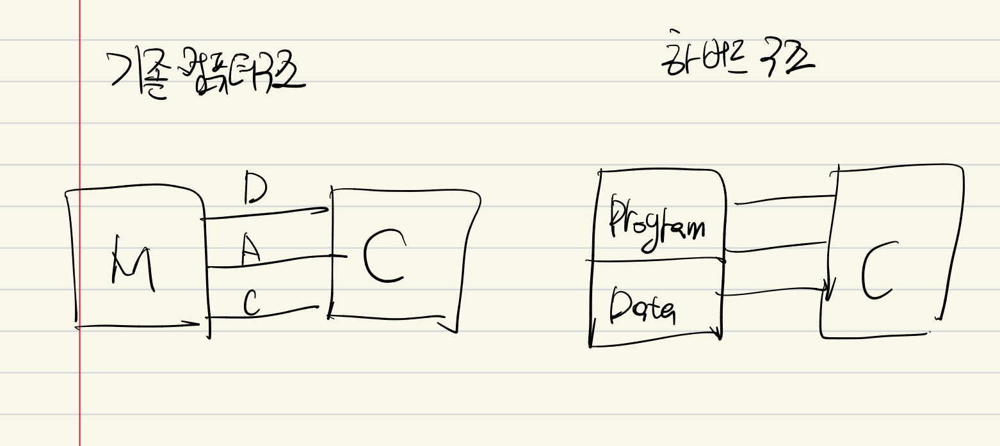
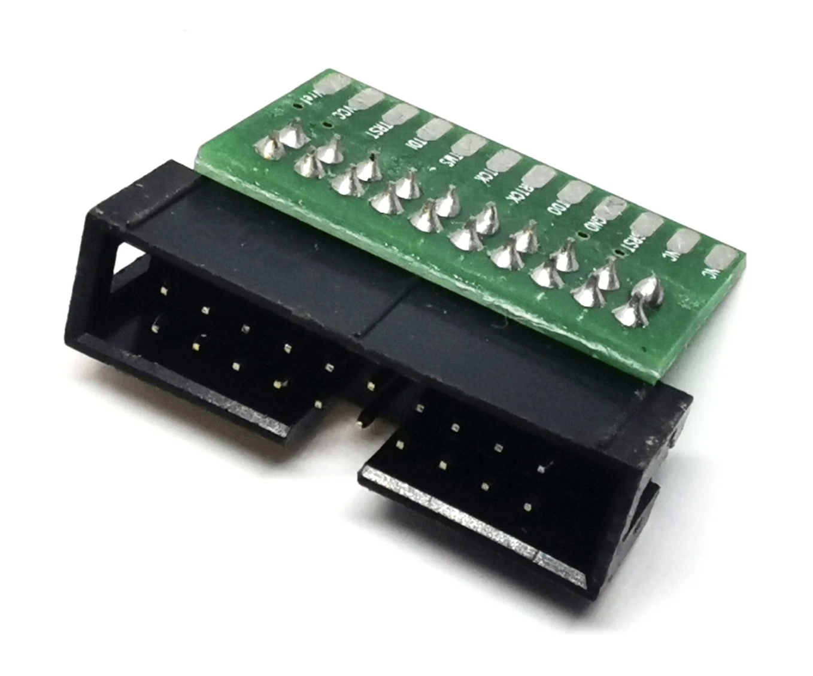
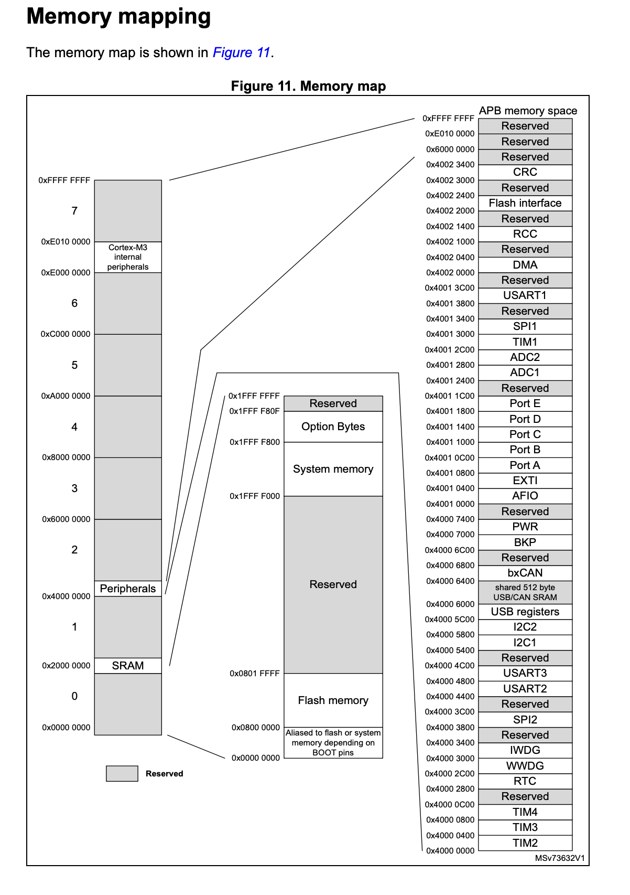

# 임베디드시스템설계

#### FPGA란?
사용자가 하드웨어 회로의 동작을 자유롭게 정의하고 수정할 수 있는 재구성 가능한 디지털 회로 칩
```
• Configurable Logic Blocks (CLBs): 논리 회로를 구성하는 기본 단위
• Routing Channels: 각 블록을 연결하는 선
• I/O Blocks: 외부 장치와 연결
• Lookup Tables (LUTs): 논리 함수 저장
• Flip-Flop: 저장 기능 제공
```

적절한 병렬 구조를 설정하지않으면 성능이 기대 이하다.

관련 사용 분야

1. 디지털 신호처리
2. 영상 처리
3. 통신(5G/SDR)
4. 자동차ADAS
5. 암호화처리/보안 하드웨어


#### 하버드 구조



#### JTAG


### STM32F103x8

#### 메모리 매핑


#### ARM 용어정리
- DSP(Digital Signal Processor) : 디지털 신호 처리 가속
- MPU(Memory protection unit): 메모리 접근 제어
- NVIC(Nested Vector Interrupt Controller): 인터렙트 제어를 담당
- FPB(Flash Patch and Breakpoint): 디버깅을 위한 장치
- DWT(Data Watchpoint and Trace): 디버깅 장치
- AHB Access Port (AHB-AP) : for debugging
- Bust Matrix : 프로세스 내부의 버스 연결을 위한 장치
- ITM(Instrumentation Trace Macrocell): for debugging
